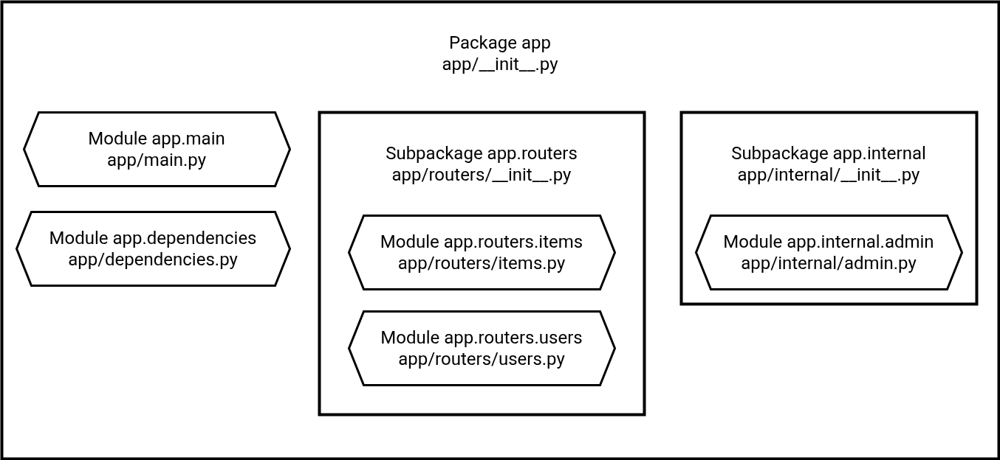

* The app directory contains everything. And it has an empty file app/__init__.py, so it is a "Python package" (a collection of "Python modules"): app.
* It contains an app/main.py file. As it is inside a Python package (a directory with a file __init__.py), it is a "module" of that package: app.main.
* There's also an app/dependencies.py file, just like app/main.py, it is a "module": app.dependencies.
* There's a subdirectory app/routers/ with another file __init__.py, so it's a "Python subpackage": app.routers.
* The file app/routers/items.py is inside a package, app/routers/, so, it's a submodule: app.routers.items.
* The same with app/routers/users.py, it's another submodule: app.routers.users.
* There's also a subdirectory app/internal/ with another file __init__.py, so it's another "Python subpackage": app.internal.
* And the file app/internal/admin.py is another submodule: app.internal.admin.
file structure with comments:
```
.
├── app                  # "app" is a Python package
│   ├── __init__.py      # this file makes "app" a "Python package"
│   ├── main.py          # "main" module, e.g. import app.main
│   ├── dependencies.py  # "dependencies" module, e.g. import app.dependencies
│   └── routers          # "routers" is a "Python subpackage"
│   │   ├── __init__.py  # makes "routers" a "Python subpackage"
│   │   ├── items.py     # "items" submodule, e.g. import app.routers.items
│   │   └── users.py     # "users" submodule, e.g. import app.routers.users
│   └── internal         # "internal" is a "Python subpackage"
│       ├── __init__.py  # makes "internal" a "Python subpackage"
│       └── admin.py     # "admin" submodule, e.g. import app.internal.admin
```


Tweaked Structure:
* app/: This is the main source code directory. All your application logic resides here. It makes it easy to run the app using uvicorn app.main:app.
  * app/core/: This folder contains global configurations and core functionalities that are used throughout the application.
  * config.py: A great place to define a Pydantic Settings class to manage environment variables and application settings. This centralizes all your configurations.
  * security.py: All security-related logic, such as JWT token creation and verification, password hashing, and dependency functions for authentication, should go here.
* app/database/: This directory handles all database-related code.
  * models.py: This file contains your database models (tables) defined using SQLAlchemy or SQLModel. Separating models from schemas helps maintain a clear distinction between the database representation and the API's data structure.
  * session.py: The setup for the database engine and the dependency for creating a new database session.
* app/api/: This is where you define your API routes and endpoints.
  * endpoints/: Each file in this subfolder should represent a major resource (e.g., users.py, movies.py, reviews.py). This keeps your routes organized and prevents main.py from becoming cluttered.
  * deps.py: Dependency injection is a core concept in FastAPI. This file can house reusable dependency functions, such as get_db for a database session or get_current_user for authentication, which can then be imported and used in your endpoints.
* app/schemas/: This folder contains all your Pydantic schemas. These are the models that define the data structure for your API requests (request bodies) and responses. By separating them from the database models, you ensure that any changes to your API's public-facing data structure don't automatically affect your database schema.
```
my-fastapi-project/
├── .venv/
├── app/
│   ├── __init__.py
│   ├── main.py             # Main application entry point
│   ├── core/
│   │   ├── __init__.py
│   │   ├── config.py       # Pydantic settings management
│   │   └── security.py     # JWT token logic, password hashing
│   ├── database/
│   │   ├── __init__.py
│   │   ├── models.py       # SQLAlchemy/SQLModel database models
│   │   └── session.py      # Database engine and session setup
│   ├── api/
│   │   ├── __init__.py
│   │   ├── endpoints/
│   │   │   ├── __init__.py
│   │   │   ├── users.py    # CRUD operations for users
│   │   │   ├── movies.py   # CRUD operations for movies
│   │   │   └── reviews.py  # CRUD operations for reviews
│   │   └── deps.py         # Dependency injection functions
│   ├── schemas/
│   │   ├── __init__.py
│   │   ├── user.py         # Pydantic schemas for users
│   │   ├── movie.py        # Pydantic schemas for movies
│   │   └── review.py       # Pydantic schemas for reviews
├── requirements.txt
├── .gitignore
├── README.md
```

## Why This Structure Is Effective
1. Separation of Concerns: Each folder has a clear responsibility (e.g., api/ for routes, database/ for data persistence, schemas/ for data validation). This makes the project easier to understand and maintain.
2. Scalability: As your project grows, you can simply add more files to the relevant folders (e.g., a new endpoint in api/endpoints/) without refactoring the entire structure.
3. Readability: A new developer joining the project can quickly navigate to the right file for a specific task, like modifying an endpoint or updating a database model.
4. Modularity: Components are self-contained and can be reused. For example, a Pydantic schema from the schemas/ folder can be used in multiple endpoints or even other parts of the application.


# Users

## Registration

1. use **post** to get data securely to the function
2. use **pydantic** for validation 